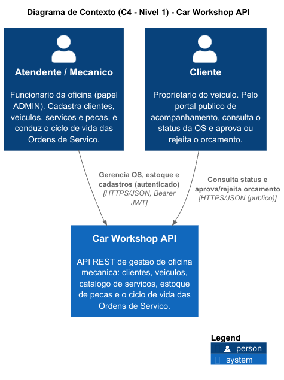
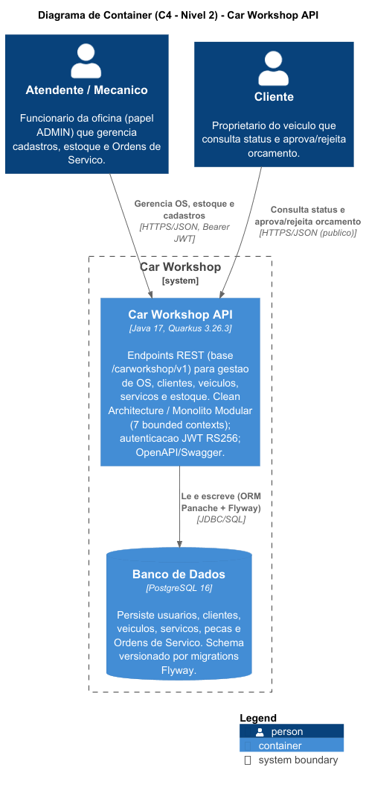
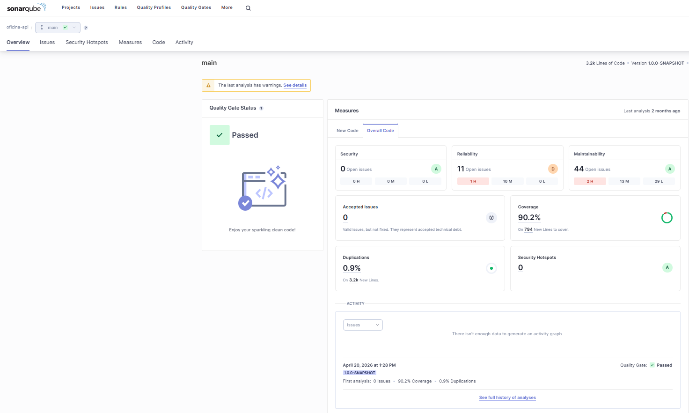
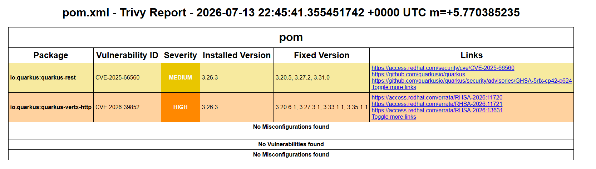

# Car Workshop API

REST API para gestão de oficina mecânica — **FIAP Tech Challenge · Fase 2**.

Construída com **Quarkus 3.26.3**, **Java 17**, **PostgreSQL 16** e autenticação **JWT**.
Na Fase 2 a aplicação foi **refatorada para Clean Architecture** e ganhou toda
a camada de infraestrutura: **containerização** (Dockerfile multi-stage), **manifestos Kubernetes**,
**Infraestrutura como Código** (Terraform) e **pipelines CI/CD** (GitHub Actions).

> 🎥 **Vídeo demo:** _(https://www.youtube.com/watch?v=ZhGXcg6D1YA)_
> 📮 **Collection da API:** a collection oficial é o **Swagger UI** embutido — suba a aplicação e
> acesse [`/carworkshop/v1/swagger-ui`](#documentação-da-api). Cada endpoint traz *Try it out*
> (payloads de exemplo + `curl` equivalente).

---

## Índice

- [Visão Geral](#visão-geral)
- [Pré-requisitos](#pré-requisitos)
- [Quick Start com Docker](#quick-start-com-docker-recomendado)
- [Modo de Desenvolvimento](#modo-de-desenvolvimento-hot-reload)
- [Variáveis de Ambiente](#variáveis-de-ambiente)
- [Autenticação JWT](#autenticação-jwt)
- [Endpoints Disponíveis](#endpoints-disponíveis)
- [Fluxo Completo (Exemplo Rápido)](#fluxo-completo-exemplo-rápido)
- [Documentação da API](#documentação-da-api)
- [Arquitetura](#arquitetura)
- [Banco de Dados](#banco-de-dados)
- [Deploy em Kubernetes (Minikube)](#deploy-em-kubernetes-minikube)
- [Provisionamento com Terraform (IaC)](#provisionamento-com-terraform-iac)
- [Testes](#testes)
- [Qualidade e Segurança](#qualidade-e-segurança)
- [CI/CD](#cicd)
- [Melhorias Futuras](#melhorias-futuras)
- [Tecnologias](#tecnologias)

---

## Visão Geral

Sistema que digitaliza as operações de uma oficina mecânica de médio porte, substituindo planilhas e
processos manuais por uma API REST completa.

**Domínios cobertos:**
- Cadastro e gestão de clientes e veículos
- Catálogo de serviços e controle de estoque de peças
- Ordens de serviço com ciclo de vida completo
- Portal de acompanhamento público para o cliente final
- Autenticação JWT com controle de acesso por papel

**Ciclo de vida da Ordem de Serviço:**
```
RECEIVED → UNDER_DIAGNOSIS → PENDING_APPROVAL → IN_PROGRESS → COMPLETED → DELIVERED
                                     └──────────────────────────────────────► CANCELED
```
> `PENDING_APPROVAL → CANCELED` ocorre quando o cliente rejeita o orçamento. `RECEIVED →
> UNDER_DIAGNOSIS` é disparado por um agendador (`@Scheduled`); as demais transições são endpoints.

---

## Pré-requisitos

| Ferramenta     | Versão mínima | Observação                                              |
|----------------|---------------|--------------------------------------------------------|
| Docker         | 24+           | suficiente para rodar local (o build acontece na imagem)|
| Docker Compose | v2            | `docker compose ...`                                    |
| Java           | 17            | só para modo dev / rodar os testes fora de container   |
| Maven          | 3.9+          | ou use o wrapper `./mvnw` incluso no projeto           |
| jq             | qualquer      | usado para extrair o token JWT nos exemplos curl       |

**Para deploy em Kubernetes** (opcional): `minikube` 1.38+, `kubectl` 1.32+, `terraform` 1.5+ —
necessários **apenas** se você for seguir as seções [Deploy em Kubernetes (Minikube)](#deploy-em-kubernetes-minikube)
e [Provisionamento com Terraform (IaC)](#provisionamento-com-terraform-iac).

> **Windows:** substitua `./mvnw` por `mvnw.cmd` nos comandos de modo dev/testes.

---

## Quick Start com Docker (recomendado)

O `Dockerfile` é **multi-stage** — o Maven compila **dentro da imagem**. Não é preciso rodar
`./mvnw package` antes: `docker compose` cuida de tudo.

```bash
# 1. Clone o repositório
git clone https://github.com/CleytonOngaratto/FIAPchallenge.git
cd FIAPchallenge

# 2. Suba a stack completa (app + banco PostgreSQL)
docker compose up --build
```

O `docker compose` sobe o **banco** (`oficina_db`), espera ele ficar *healthy* (`pg_isready`) e só
então sobe a **aplicação** (`oficina_app`) — a app só fica `ready` depois que o Postgres responde.

Confirme que subiu (o `/health/ready` inclui o check do banco):

```bash
curl -s http://localhost:8080/carworkshop/v1/q/health/ready
# {"status":"UP", ...}
```

A API fica disponível em `http://localhost:8080/carworkshop/v1`.

> O Flyway aplica as migrations e insere dados de seed: **3 clientes**, **3 veículos**,
> **10 serviços** e **10 peças** prontos para uso.

**Portas:** app em `8080`; o banco é exposto no host em `5433` por padrão (configurável via
`DB_PORT_HOST` no `.env` — ver [.env.example](.env.example)). O SonarQube fica num profile separado
e **não** sobe no fluxo padrão:

```bash
docker compose --profile sonar up      # inclui o SonarQube em http://localhost:9000
```

---

## Modo de Desenvolvimento (hot reload)

```bash
# 1. Inicia apenas o banco (exposto no host em 5433, que é o default do datasource dev)
docker compose up -d oficina_db

# 2. Sobe a aplicação com live coding
./mvnw quarkus:dev
```

- API: `http://localhost:8080/carworkshop/v1`
- Dev UI: `http://localhost:8080/carworkshop/v1/q/dev/`
- Swagger UI: `http://localhost:8080/carworkshop/v1/swagger-ui`

---

## Variáveis de Ambiente

A aplicação consome estas variáveis (o Quarkus faz o *override* automático dos valores do
`application.properties`):

| Variável                          | Descrição                                    | Padrão (dev local)                              |
|-----------------------------------|----------------------------------------------|-------------------------------------------------|
| `SECRET_KEY`                      | Chave usada no hash de senhas (SHA-256 + salt)| `oficina-secret-key-dev`                        |
| `QUARKUS_DATASOURCE_JDBC_URL`     | URL JDBC do PostgreSQL                        | `jdbc:postgresql://localhost:5433/oficina_db`   |
| `QUARKUS_DATASOURCE_USERNAME`     | Usuário do banco                             | `postgres`                                      |
| `QUARKUS_DATASOURCE_PASSWORD`     | Senha do banco                               | `postgres`                                      |

> No `docker compose` esses valores já são injetados (a app aponta para o service `oficina_db` na
> rede interna). No Kubernetes vêm do **ConfigMap** (não sensível) + **Secret** (`SECRET_KEY` e
> credenciais) — ver seção de deploy.

---

## Autenticação JWT

Endpoints administrativos exigem um token JWT no header `Authorization: Bearer <token>` e o papel
`ADMIN`. Os endpoints de acompanhamento (`/tracking/*`) e de autenticação (`/auth/*`) são
**públicos**. Tokens (RS256, SmallRye JWT) expiram em **1 hora**.

### Passo a passo

```bash
# 1. Criar conta admin (só na primeira vez)
curl -s -X POST http://localhost:8080/carworkshop/v1/auth/signup \
  -H "Content-Type: application/json" \
  -d '{"username":"admin","password":"Admin@123","roles":["ADMIN"]}'

# 2. Login — obter token e exportar para a sessão
export TOKEN=$(curl -s -X POST http://localhost:8080/carworkshop/v1/auth/login \
  -H "Content-Type: application/json" \
  -d '{"username":"admin","password":"Admin@123"}' \
  | jq -r '.token')

echo "Token: $TOKEN"

# 3. Usar nas chamadas
curl -s http://localhost:8080/carworkshop/v1/customers/get-all \
  -H "Authorization: Bearer $TOKEN" | jq .
```

---

## Endpoints Disponíveis

| Grupo                | Base Path              | Auth    | Descrição                                        |
|----------------------|------------------------|---------|--------------------------------------------------|
| Auth                 | `/auth`                | Público | Signup e login                                   |
| Clientes             | `/customers`           | ADMIN   | CRUD de clientes com validação de CPF            |
| Veículos             | `/vehicles`            | ADMIN   | CRUD de veículos com validação de placa          |
| Serviços             | `/service`             | ADMIN   | Catálogo de serviços com precificação            |
| Peças e Suprimentos  | `/parts-and-supplies`  | ADMIN   | Estoque de peças com controle de quantidade      |
| Ordens de Serviço    | `/work-orders`         | ADMIN   | Criação e gestão do ciclo de vida completo       |
| Acompanhamento       | `/tracking`            | Público | Portal do cliente: consulta e aprovação/rejeição |

Para **exemplos completos de cada endpoint** (payloads, parâmetros e respostas), use o **Swagger UI**
(`/carworkshop/v1/swagger-ui`): o botão **Try it out** executa a chamada real e mostra o `curl`
equivalente. É a nossa collection oficial — ver [Documentação da API](#documentação-da-api).

---

## Fluxo Completo (Exemplo Rápido)

```bash
# Após exportar o TOKEN (ver seção Autenticação acima)

# Consultar clientes já criados pelo seed
curl -s http://localhost:8080/carworkshop/v1/customers/get-all \
  -H "Authorization: Bearer $TOKEN" | jq .

# Criar uma ordem de serviço para o cliente 1, veículo 1, com o serviço 1
curl -s -X POST http://localhost:8080/carworkshop/v1/work-orders \
  -H "Content-Type: application/json" \
  -H "Authorization: Bearer $TOKEN" \
  -d '{"customer_id":1,"vehicle_id":1,"service_ids":[1]}' | jq .

# O cliente acompanha a OS pelo portal público (sem token)
curl -s http://localhost:8080/carworkshop/v1/tracking/1 | jq .
```

---

## Documentação da API

A **API é autodocumentada via OpenAPI/Swagger** — esta é a **collection oficial** do projeto (não há
Postman/OpenAPI exportado à parte). Suba a aplicação e acesse:

| Recurso       | URL                                                   |
|---------------|-------------------------------------------------------|
| Swagger UI    | `http://localhost:8080/carworkshop/v1/swagger-ui`     |
| OpenAPI JSON  | `http://localhost:8080/carworkshop/v1/q/openapi`      |

No Swagger UI, o **Try it out** de cada endpoint executa a chamada e exibe o `curl` correspondente.

---

## Arquitetura

A aplicação combina **Clean Architecture** (camadas concêntricas — dependências só apontam para
dentro) com **Monólito Modular** (bounded contexts isolados por pacote, prontos para extração em
microsserviços). O **núcleo (`domain` + `usecase`) é Java puro** — sem `jakarta.*`/`io.quarkus.*`;
o framework mora só nas camadas externas. As regras abaixo são **impostas por testes** (ArchUnit).

### Visão C4 (Contexto e Container)

Diagramas C4 do sistema (fonte PlantUML em [`docs/c4model/`](docs/c4model)). As imagens abaixo já
estão renderizadas — não é preciso IntelliJ nem plugin para vê-las.

**Nível 1 — Contexto** — atores e o sistema como caixa-preta:



**Nível 2 — Container** — a API (Quarkus) e o banco de dados (PostgreSQL):



### Camadas (a dependência só aponta para dentro)

```text
┌─────────────────────────────────────────┐
│              Infrastructure              │  ← Quarkus, JPA/Panache, JWT, CDI, producers
│  ┌───────────────────────────────────┐  │
│  │             Adapter               │  │  ← Controllers, Gateways, DTOs, Presenters
│  │  ┌─────────────────────────────┐ │  │
│  │  │          Use Case           │ │  │  ← Interactors (Java puro), Ports (interfaces)
│  │  │  ┌───────────────────────┐  │ │  │
│  │  │  │        Domain         │  │ │  │  ← Entities, Validators, Value Objects (Java puro)
│  │  │  └───────────────────────┘  │ │  │
│  │  └─────────────────────────────┘ │  │
│  └───────────────────────────────────┘  │
└─────────────────────────────────────────┘

Regra de ouro: nenhuma camada interna importa uma camada mais externa.
```

| Camada             | Responsabilidade                                                        | Framework? |
|--------------------|-------------------------------------------------------------------------|------------|
| **Domain**         | Entidades, regras de negócio (state machine, invariantes), validadores  | ❌ Java puro |
| **Use Case**       | Interactors que orquestram o domínio; injeção por **construtor**; Ports (in/out) | ❌ Java puro |
| **Adapter**        | Controllers (REST), Gateways (impl. dos ports), DTOs, Presenters        | ✅ `@Inject`/`@ApplicationScoped` |
| **Infrastructure** | Producers CDI (`@Produces` por módulo), JPA/Panache, MapStruct          | ✅ Quarkus |

A amarração CDI do interactor mora num **producer por módulo** (`infrastructure/config/XModuleConfig`),
mantendo o `usecase` livre do framework.

### Bounded Contexts (7 pacotes)

`workorder` é o **hub**: fala com os outros contextos **apenas pelos ports públicos** deles (via
data gateways), nunca pelo Panache alheio.

```text
workorder  ── hub das Ordens de Serviço. Consome os outros contextos SEMPRE pelo
   │           port público de cada um (via data gateways) — nunca o Panache alheio.
   ├──▶ customer       (port público)
   ├──▶ vehicle        (port público)
   ├──▶ autoservice    (port público)
   └──▶ inventory      (port público)

vehicle  ──▶ customer   valida se o dono existe, também via port público.

shared   ◀── usado por  auth · customer · vehicle · autoservice · inventory · workorder
             infra transversal: exceções, error response e mappers HTTP.
```

Estrutura interna de cada módulo:

```
{modulo}/
├── domain/           ← entity/ (regras de negócio) + validator/   [Java puro]
├── usecase/          ← port/in/ · port/out/ · interactor/          [Java puro]
├── adapter/          ← controller/ · dto/ · presenter/ · gateway/
└── infrastructure/   ← config/ (producer CDI) · persistence/ (JPA) · mapper/ (MapStruct)
```

### Modelo de Domínio (estado desacoplado — Fase 2)

Os contextos foram **desacoplados** para viabilizar a extração em microsserviços:

- **Cliente** é um agregado próprio — não conhece `vehicle` (sem `@OneToMany`); pode existir sem veículo.
- **Veículo** referencia o dono por `customerId` (`Long`), **sem FK cruzada** (a migration `V3.0.0`
  dropou a FK). Todo veículo **exige** um `customerId` válido (validado via port público do `customer`):
  ausente → HTTP 400; cliente inexistente → HTTP 404.
- **Ordem de Serviço** guarda `customer_id`/`vehicle_id` (`Long`) + **snapshots** (`customer_email`,
  `vehicle_plate`, e serviços/peças com **nome e preço da época**). Preserva o histórico mesmo que
  cliente/serviço/peça mudem depois — trade-off: perde-se o *live join*, ganha-se desacoplamento.

---

## Banco de Dados

### Justificativa da escolha: PostgreSQL 16

**Por que banco relacional?**
O domínio da oficina é altamente relacional: uma Ordem de Serviço referencia um Cliente, um Veículo,
múltiplos Serviços e múltiplas Peças. Um banco relacional garante integridade e transações ACID,
eliminando inconsistências difíceis de controlar em nível de aplicação.

**Por que PostgreSQL e não MySQL ou MariaDB?**
PostgreSQL tem conformidade mais rigorosa com o padrão SQL, MVCC (Multiversion Concurrency Control)
para transações concorrentes e tipagem mais rica. Para um controle de estoque com leituras e
atualizações simultâneas, o MVCC reduz contenção de locks. É também o banco suportado nativamente
pelo ecossistema Quarkus + Hibernate Panache.

**Por que não NoSQL (MongoDB, DynamoDB)?**
Os dados têm esquema bem definido e relacionamentos N:M (OS ↔ Serviços, OS ↔ Peças). A consistência
eventual típica de NoSQL não é adequada a um sistema transacional onde o controle de estoque e a
progressão do status de uma OS precisam ser atômicos.

**Migrations (Flyway):**

| Versão | Descrição |
|--------|-----------|
| V1.0.0 | Schema completo: tabelas, sequences, dados de seed |
| V2.0.0 | `work_orders.deleted` (soft-delete) |
| V3.0.0 | Desacopla `vehicle`↔`customer` (dropa a FK cruzada; `owner_id` vira `customerId Long`) |
| V4.0.0 | `work_orders` com `customer_id`/`vehicle_id` (`Long`) + snapshots; dropa FKs cruzadas |

| Ambiente   | Banco         | URL                                                |
|------------|---------------|----------------------------------------------------|
| Dev local  | PostgreSQL 16 | `jdbc:postgresql://localhost:5433/oficina_db`      |
| Testes     | H2 in-memory  | schema `create-drop` + seed em `import-test.sql`   |
| Kubernetes | PostgreSQL 16 | `jdbc:postgresql://postgres.car-workshop.svc.cluster.local:5432/oficina_db` |

---

## Deploy em Kubernetes (Minikube)

Manifestos completos em [`k8s/`](k8s) — app + banco, com **HPA** funcional (autoescala por CPU).

| Diretório            | Manifestos |
|----------------------|------------|
| `k8s/application/`   | `namespace`, `configmap`, `secret`, `deployment`, `service` (ClusterIP), `hpa` (autoscaling/v2) |
| `k8s/database/`      | `postgres-secret`, `postgres-pvc` (1Gi), `postgres-deployment` (probes `pg_isready`), `postgres-service` |

> **namespace:** `car-workshop` · **app:** `car-workshop-api` · **HPA:** min 2 / max 10, CPU 60% +
> memória 80%. As probes da app usam o **caminho com root-path**
> (`/carworkshop/v1/q/health/live` e `/ready`); a `startupProbe` cobre o boot (Quarkus + Flyway).

```bash
# Pré-requisitos (uma vez)
minikube start
minikube addons enable metrics-server          # OBRIGATÓRIO para o HPA (senão % = <unknown>)
docker build -t car-workshop-api:local .        # a partir da RAIZ do repositório
minikube image load car-workshop-api:local      # sobe a imagem local sem ir ao registry

# Aplicar (banco antes da app)
kubectl apply -f k8s/database/
kubectl apply -f k8s/application/

# Acompanhar e verificar
kubectl -n car-workshop rollout status deploy/car-workshop-api
kubectl -n car-workshop get pods,svc,hpa        # o HPA deve mostrar % real, não <unknown>

# Smoke test (curl roda na sua máquina; a base JRE não traz curl)
kubectl -n car-workshop port-forward svc/car-workshop-api 8080:8080 &
curl http://localhost:8080/carworkshop/v1/q/health/ready   # 200 {"status":"UP"}
```

### Demo de autoescala (HPA por CPU)

Com o `metrics-server` ligado, gere carga e observe as réplicas subirem:

```bash
kubectl -n car-workshop run load --image=busybox --restart=Never -- \
  /bin/sh -c "while true; do wget -qO- http://car-workshop-api.car-workshop.svc.cluster.local:8080/; done"

kubectl -n car-workshop get hpa -w     # réplicas sobem conforme a CPU
```

---

## Provisionamento com Terraform (IaC)

O mesmo deploy, **versionado como código** com o provider `kubernetes` puro (sem helm) — tradução
1:1 dos manifestos de `k8s/`. O Terraform sobe **banco + app**; o **cluster Minikube é pré-requisito
manual** (`minikube start`).

```text
FLUXO DE DEPLOY
  Dev/CI  ──docker build──▶  imagem car-workshop-api  ──minikube image load──▶  cluster
  Dev/CI  ──terraform apply──────────────────────────────────────────────────▶  cluster

DENTRO DO CLUSTER  (namespace car-workshop) — o que o `terraform apply` cria:

  ConfigMap ─┐
  Secret     ├──▶  Deployment car-workshop-api  ──▶  Service ClusterIP :8080
  (creds +   │            ▲          │
   SECRET)  ─┘            │          └──JDBC──▶  Service postgres :5432
                         HPA                          │
                    escala 2..10                      ▼
                 (CPU 60% / mem 80%)          Deployment postgres  ──▶  PVC 1Gi
```

```bash
cd infra/terraform/environments/minikube

# 1. Copie o molde e preencha os segredos (db_password, secret_key)
cp ../../terraform.tfvars.example ../../terraform.tfvars   # depois edite os CHANGE_ME

# 2. Init + validação (leve, não toca no cluster)
terraform init
terraform validate

# 3. Prévia e apply
terraform plan  "-var-file=../../terraform.tfvars"
terraform apply "-var-file=../../terraform.tfvars"
```

> ⚠️ **Windows/PowerShell:** mantenha o `-var-file` **entre aspas** (`"-var-file=..."`), senão o
> PowerShell quebra o argumento no `=`. As aspas são inofensivas no bash/Linux.

Segredos (`db_password`, `secret_key`) **não têm default** e o `terraform.tfvars` está no
`.gitignore` — nada é hardcoded nos `.tf` (passe por `-var-file` ou `-var`).

**Estrutura** — módulos reutilizáveis + o ambiente `minikube` como raiz que os chama:

```text
infra/terraform/
├── modules/
│   ├── postgres/        # namespace + secret + pvc + deployment + service (Postgres 16)
│   └── application/     # configmap + secret + deployment + service + hpa (v2) da API
└── environments/
    └── minikube/        # PRINCIPAL: provider aponta pro contexto minikube; chama os 2 módulos
```

**Recursos provisionados** (tradução 1:1 dos manifestos de `k8s/`):

| Módulo      | Objetos Kubernetes criados |
|-------------|-----------------------------|
| postgres    | Namespace `car-workshop` · Secret `postgres-secret` · PVC `postgres-pvc` (1Gi) · Deployment `postgres` (probes `pg_isready`) · Service `postgres` (ClusterIP :5432) |
| application | ConfigMap `car-workshop-api-config` · Secret `car-workshop-api-secret` (creds + `SECRET_KEY`) · Deployment `car-workshop-api` (startup/liveness/readiness) · Service `car-workshop-api` (ClusterIP :8080) · HPA (CPU 60% + mem 80%) |

**Variáveis principais:**

| Variável         | Default                   | Nota |
|------------------|---------------------------|------|
| `db_password`    | — (obrigatória)           | Senha do banco (a mesma nos 2 módulos). **Segredo.** |
| `secret_key`     | — (obrigatória)           | Chave do hash de senha da app. **Segredo.** |
| `db_user`        | `postgres`                | Não é segredo. |
| `app_image`      | `car-workshop-api:local`  | Sobrescreve a imagem (ex.: tag de CI). |
| `kube_context`   | `minikube`                | Contexto do kubeconfig. |
| `create_cluster` | `false`                   | Se `true`, o Terraform sobe o próprio cluster (ver abaixo). |

**Idempotência:** um segundo `terraform apply` dá `No changes`. O Deployment da app usa
`ignore_changes = [spec[0].replicas]` para **não** brigar com o HPA depois que ele escala. Para
derrubar tudo: `terraform destroy "-var-file=../../terraform.tfvars"`.

**Opção — o Terraform provisiona o próprio cluster (`create_cluster`):** não é o caminho default (o
provider `kubernetes` precisa do cluster já no `plan`), então o apply roda em **2 fases**:

```bash
terraform apply "-target=null_resource.minikube" -var create_cluster=true    # sobe minikube + metrics-server
terraform apply "-var-file=../../terraform.tfvars" -var create_cluster=true   # sobe banco + app
```

---

## Testes

```bash
# Roda todos os testes (H2 em memória, sem banco externo necessário)
./mvnw clean verify

# Roda uma classe específica
./mvnw test -Dtest=WorkOrderInteractorTest
```

- **Suíte:** **404 testes** automatizados, todos verdes (`./mvnw clean verify` → `BUILD SUCCESS`).
- **Tipos:** unidade (Mockito), HTTP real (REST-Assured) e **arquitetura** (ArchUnit — trava as
  regras da Clean Architecture; uma violação nova quebra o build).
- **Cobertura:** gate **de 75%** (BUNDLE/INSTRUCTION) via JaCoCo, configurado no `pom.xml` — o
  desafio não fixa um percentual mínimo; o piso é um alvo interno de qualidade.
- **Porta de testes:** 9090.

O relatório de cobertura HTML é gerado em `target/site/jacoco/index.html` após `./mvnw clean verify`.

---

## Qualidade e Segurança

Duas frentes cuidam da saúde do código e da segurança da aplicação: **análise estática** (SonarQube)
e **scan de vulnerabilidades** (Trivy). Ambos rodam localmente e no CI.

### SonarQube (análise estática)

Instância local do SonarQube Community Edition, num profile separado do compose:

```bash
# 1. Suba o container do SonarQube
docker compose --profile sonar up -d sonarqube

# 2. Aguarde inicializar (~60s) e acesse http://localhost:9000 (login padrão admin/admin)

# 3. Execute a análise (substitua <sua_senha> pela senha definida)
./mvnw clean verify sonar:sonar \
  "-Dsonar.host.url=http://localhost:9000" \
  "-Dsonar.login=admin" \
  "-Dsonar.password=<sua_senha>"
```

> **Nota Windows (PowerShell):** use aspas nos parâmetros `-D` para evitar problemas com o parser.



### Trivy (scan de vulnerabilidades)

O CI roda o **Trivy** pela imagem oficial fixada `aquasec/trivy:0.58.0` (reprodutível; o banco de
vulnerabilidades é baixado fresco a cada scan). Cobre `CRITICAL`, `HIGH` e `MEDIUM`; é **advisory**
(um achado não derruba o build) e publica um relatório HTML como *artifact* da pipeline (retido 30
dias em **Actions → execução → Artifacts**). Para rodar o mesmo scan localmente:

```bash
docker run --rm -v "${PWD}:/workspace" aquasec/trivy:0.58.0 \
  fs /workspace --severity CRITICAL,HIGH,MEDIUM
```



### Boas práticas já aplicadas

- **Zero credencial hardcoded** nos workflows e no Terraform (tudo via GitHub Secrets / variáveis sem
  default; `terraform.tfvars` no `.gitignore`).
- Imagem roda **não-root** (uid 1001).
- O Secret do Kubernetes carrega **apenas** credenciais de banco + `SECRET_KEY`.

---

## CI/CD

GitHub Actions cobre o fluxo completo exigido pela Fase 2:

| Workflow                                                 | Gatilho                     | O que faz |
|----------------------------------------------------------|-----------------------------|-----------|
| [`maven-ci.yml`](.github/workflows/maven-ci.yml)         | push/PR na `main`           | `mvn clean verify` (build + testes + gate de cobertura) e **scan de vulnerabilidades** com Trivy |
| [`cd.yml`](.github/workflows/cd.yml)                     | manual / push/PR na `main`  | build → imagem → sobe **Minikube efêmero** no runner → `terraform apply` (banco + app) → `rollout` + **smoke test** do `/health/ready` |

**Análise de vulnerabilidades (Trivy):** roda no `maven-ci` e publica um relatório HTML como
*artifact* da pipeline. Detalhes da configuração e como reproduzir local em
[Qualidade e Segurança](#qualidade-e-segurança).

> ⚠️ **O cluster do `cd.yml` é efêmero** — nasce e morre com o job. É **prova de pipeline**, não um
> ambiente vivo (não há URL persistente). O vídeo demo e a avaliação rodam **local** (Minikube na
> máquina), incluindo a autoescala por CPU.

---

## Melhorias Futuras

**Chave JWT fora do repositório/imagem:** a chave privada JWT (`src/main/resources/privateKey.pem`)
hoje é commitada e vai assada na imagem (classpath). A correção ideal — fora do escopo desta fase — é
**tirar a chave do repo/imagem** e montá-la de um Secret/volume do Kubernetes em runtime.

**Ambiente AWS/EKS:** o alvo provisionado nesta fase é o Minikube. Um `environments/aws-eks/` (AWS
Academy, via LabRole) fica como trabalho futuro — lá o Terraform criaria o cluster nativamente
(`aws_eks_cluster` + node group), também sem nenhuma credencial hardcoded.

> As boas práticas de segurança **já aplicadas** (não-root, zero credencial hardcoded, Secrets)
> estão em [Qualidade e Segurança](#qualidade-e-segurança).

---

## Tecnologias

| Tecnologia                  | Versão   | Uso                                           |
|-----------------------------|----------|-----------------------------------------------|
| Quarkus                     | 3.26.3   | Framework principal (REST, DI, config, ORM)   |
| Java                        | 17       | Linguagem                                     |
| PostgreSQL                  | 16       | Banco de dados de produção                    |
| Hibernate ORM Panache       | —        | Acesso a dados (`PanacheRepository`)          |
| Flyway                      | —        | Migrations versionadas de banco               |
| SmallRye JWT                | —        | Autenticação JWT (RS256)                      |
| MapStruct                   | 1.5.5    | Mapeamento Domain ↔ JPA Entity                |
| Lombok                      | 1.18.30  | Redução de boilerplate (compile-time)         |
| SmallRye OpenAPI            | —        | Documentação Swagger automática               |
| JUnit 5 · Mockito · REST-Assured · ArchUnit | — | Testes: unidade, HTTP e arquitetura        |
| JaCoCo                      | 0.8.12   | Cobertura de testes (gate de 75% no `pom.xml`)|
| Docker + Docker Compose     | —        | Containerização (Dockerfile multi-stage)      |
| Kubernetes + Minikube       | —        | Orquestração e deploy                         |
| Terraform (provider `kubernetes`) | 1.5+ | Infraestrutura como Código (banco + app)     |
| GitHub Actions              | —        | CI/CD (build, testes, scan, deploy)           |
| Trivy (Aqua Security)       | 0.58.0   | Scan de vulnerabilidades no CI                |
| SonarQube Community Edition | 10.4.1   | Análise estática de qualidade                 |
