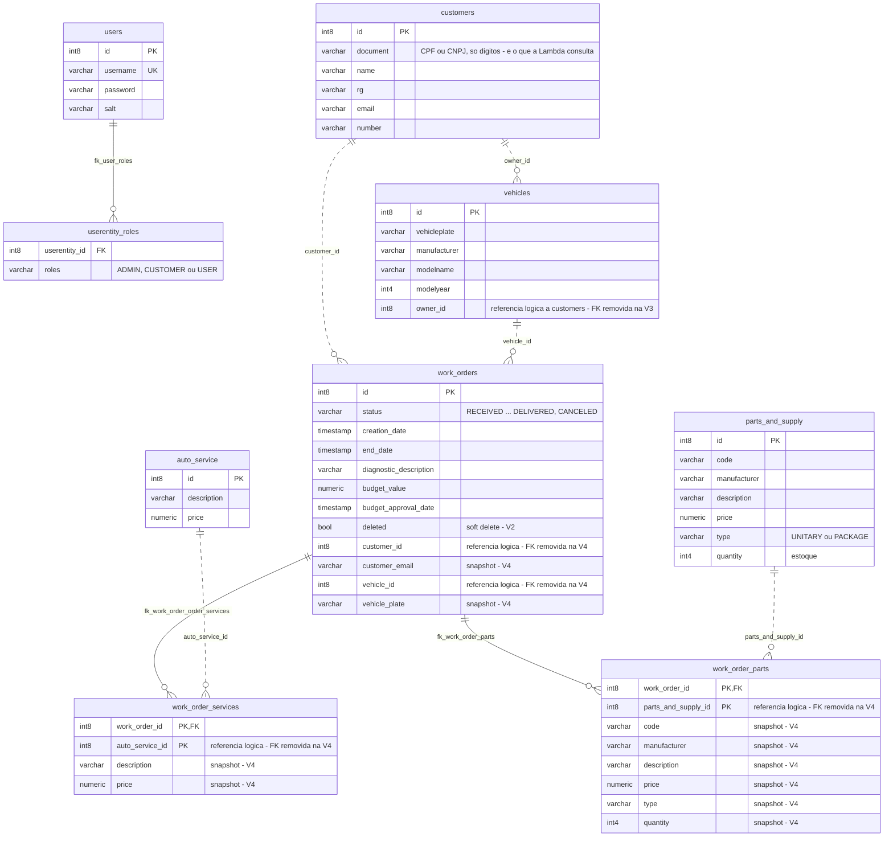

# Banco de dados — justificativa, modelo ER e relacionamentos

## Por que relacional, por que PostgreSQL, por que RDS

**Relacional.** O domínio é de integridade transacional: uma ordem de serviço referencia cliente,
veículo, N serviços e N peças; aprovar o orçamento consome estoque e muda o status **na mesma
transação**. Consistência eventual aqui produziria estoque negativo ou OS em estado impossível.

**PostgreSQL 16.** MVCC para leituras e escritas concorrentes (o controle de estoque é o caso),
tipagem rica, e é o engine que a aplicação já usava no desenvolvimento e nos testes de integração
da Fase 2 — nenhuma diferença de dialeto entre a máquina do desenvolvedor e a nuvem.

**RDS gerenciado, não Postgres no cluster.** Na Fase 2 o banco era um pod no Minikube. Na nuvem isso
significaria dado que morre com o cluster, backup por conta própria, TLS por conta própria e um
StatefulSet competindo por memória com a aplicação nos dois nós. O RDS entrega backup automático,
criptografia em repouso, TLS obrigatório (`rds.force_ssl = 1`) e recriação em outra AZ se a original
cair — por US$ 0,017/h numa `db.t3.micro`. Dimensionamento, segurança e senha estão na
[RFC-002](rfc/RFC-002-banco-rds-postgres.md).

**Schema versionado pela aplicação.** O Flyway roda no boot (`migrate-at-start`), não no Terraform:
o schema pertence a quem o usa. O repositório de infraestrutura cria a instância e um banco vazio;
a primeira réplica que sobe aplica V1 → V4 e as seguintes só validam.

## Modelo ER

Linha **cheia** = chave estrangeira física, ainda existente no banco. Linha **tracejada** =
referência lógica por `Long id`, cuja FK foi removida nas migrations V3 e V4 (ver abaixo).

Tipos abreviados para o diagrama: no banco, `varchar` é `varchar(255)`, `numeric` é
`numeric(38,2)` e `timestamp` é `timestamp(6)` — fonte em
[`V1.0.0__oficina.sql`](../../src/main/resources/db/migration/V1.0.0__oficina.sql).

### Tabelas e módulos

| Tabela | Bounded context | Papel |
|---|---|---|
| `users`, `userentity_roles` | `auth` | Conta do atendente (senha com hash + salt + *pepper*) e seus papéis. O cliente **não** tem conta: autentica-se pelo CPF na Lambda |
| `customers` | `customer` | Cadastro. `document` guarda 11 dígitos crus — é a coluna que a Lambda consulta com `WHERE document = $1` |
| `vehicles` | `vehicle` | Veículo com dono por `owner_id` (`Long`), sem FK desde a V3 |
| `auto_service` | `autoservice` | Catálogo de serviços com preço atual |
| `parts_and_supply` | `inventory` | Peças e insumos com `quantity` (estoque) |
| `work_orders` | `workorder` | A entidade central, com a máquina de estados e os snapshots |
| `work_order_services`, `work_order_parts` | `workorder` | Itens da OS, com **cópia** de descrição e preço da época (`@ElementCollection`) |

Cada tabela tem uma sequence própria `INCREMENT BY 1`, e as seis entidades JPA declaram
`@SequenceGenerator(allocationSize = 1)` para casar com ela. Sem isso o Hibernate assume 50, cada
réplica reserva um bloco de 50 ids a partir de um `nextval` que avança 1, os blocos se sobrepõem e a
escrita concorrente morre com `duplicate key`. Latente na Fase 2 (uma réplica), apareceu em
2026-09-03 com duas réplicas e um rollout no meio da carga, e foi corrigido sem migration.

## Migrations (Flyway)

| Versão | Arquivo | O que faz |
|---|---|---|
| V1.0.0 | `V1.0.0__oficina.sql` | Schema completo com FKs entre todos os agregados, sequences e dados de seed |
| V2.0.0 | `V2.0.0__add_soft_delete.sql` | `work_orders.deleted` — OS concluída ou entregue pode ser removida logicamente |
| V3.0.0 | `V3.0.0__decouple_vehicle_customer.sql` | Remove `fk_customer_vehicles`; `owner_id` vira referência lógica |
| V4.0.0 | `V4.0.0__decouple_workorder_crossmodule.sql` | Adiciona e preenche os snapshots em `work_orders`, `work_order_services` e `work_order_parts`; remove as FKs para `customers`, `vehicles`, `auto_service` e `parts_and_supply` |

As quatro foram conferidas no próprio RDS em 2026-09-01 (`flyway_schema_history` com `success = t`
de V1.0.0 a V4.0.0, lido por um pod `psql` com a credencial do Secret).

## Desacoplamento por `Long id` + snapshot (V3 e V4)

**O problema que resolve.** Com FKs cruzadas, `work_orders` só existe se `customers`, `vehicles`,
`auto_service` e `parts_and_supply` estiverem no **mesmo banco**. Isso amarra os bounded contexts no
nível físico: nenhum deles pode ser extraído para um serviço com banco próprio sem uma migration de
dados entre bancos.

**O que mudou.**

- A referência continua na coluna (`customer_id`, `vehicle_id`, `owner_id`, `auto_service_id`,
  `parts_and_supply_id`), mas como `Long` sem constraint. No JPA, `@ManyToOne` e `@ManyToMany`
  viraram `Long` + `@ElementCollection`.
- O que a OS precisa **mostrar** sem consultar o outro módulo foi copiado no momento da criação:
  e-mail do cliente, placa do veículo, descrição e preço de cada serviço e peça.
- A regra que o banco garantia passa a ser garantida pelo caso de uso **antes** de persistir:
  `WorkOrderInteractor.create` busca os quatro agregados pelos ports e responde 404 se algum não
  existe; `VehicleInteractor` faz o mesmo para o dono do veículo.

**O que se ganha.** Cada agregado pode ir para um banco ou serviço próprio sem tocar em
`work_orders`; a OS é um registro histórico autocontido — o orçamento aprovado não muda porque o
preço do catálogo mudou depois.

**O que se perde, de propósito.** O *live join*: se o cliente trocar de e-mail, as OS antigas guardam
o e-mail da época. Não há mais integridade referencial física — um `DELETE` em `customers` não é
barrado pelo banco. A aplicação não expõe exclusão de cliente, veículo, serviço ou peça, então hoje o
risco é só de acesso direto ao banco. Se essa operação vier a existir, terá de checar as OS ativas no
caso de uso.

## O que a Lambda lê

Só `customers.document`, por igualdade com os 11 dígitos recebidos, por TLS, num pool de uma conexão
por container (`fiap-fase3-auth-serverless/lambda/db.mjs`). Não há coluna de status nem de soft
delete em `customers` — o requisito de "cliente ativo" foi reduzido a "cliente existe", conforme
combinado com os professores, e nenhuma migration nova foi criada para isso.
