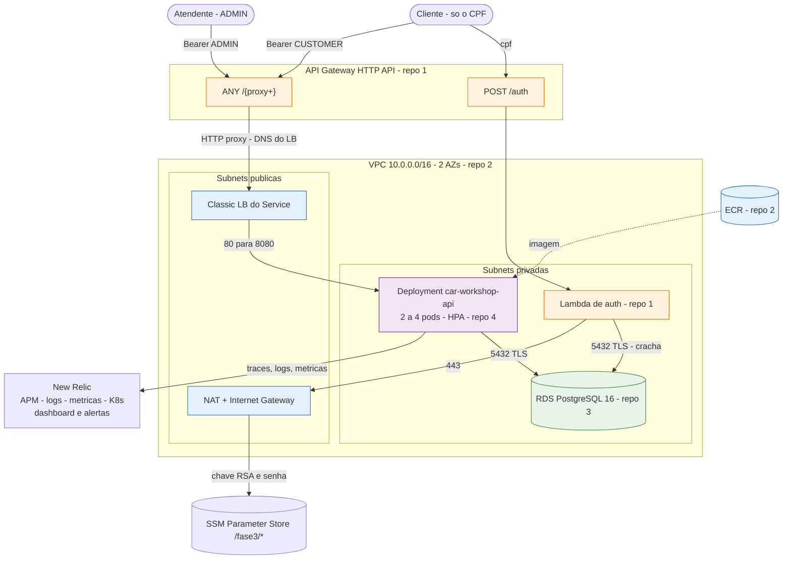
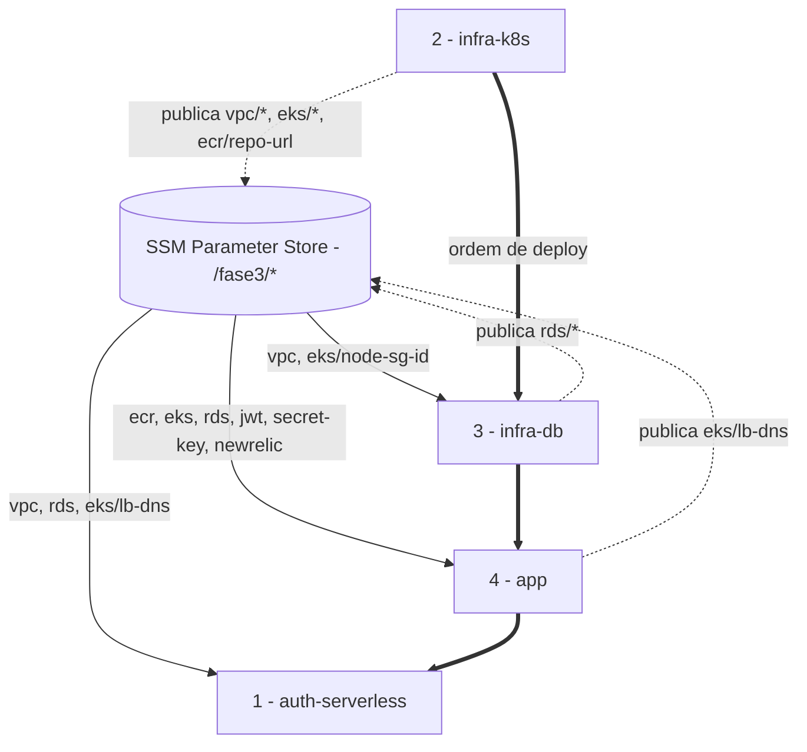

# Diagrama de componentes — Car Workshop na AWS

A aplicação e o banco são os mesmos da Fase 2 (ver o [C4 de Container](../c4model/Diagrama_de_Container.png)).
O que muda é o entorno: uma borda com API Gateway e Lambda, o cluster EKS, o RDS gerenciado e a
observabilidade no New Relic — cada parte provisionada por um repositório próprio e conectada às
outras pelo SSM Parameter Store.

## Componentes em execução

Cores: laranja = repositório 1 (`auth-serverless`), azul = 2 (`infra-k8s`), verde = 3 (`infra-db`),
roxo = 4 (`app`). O SSM e o New Relic não pertencem a um repositório: o primeiro é o contrato entre
todos, o segundo é o destino da telemetria.

### O que cada componente é, e onde está definido

| Componente | Repositório | Definição | Detalhes que importam |
|---|---|---|---|
| VPC, subnets, IGW, NAT, endpoint S3 | 2 | `vpc.tf` | `10.0.0.0/16`, uma subnet pública e uma privada por AZ, ambas `/20`; **um** NAT; endpoint S3 gratuito tira o `docker pull` do NAT. Tags `kubernetes.io/role/elb` e `internal-elb` são o que permite ao EKS criar load balancers |
| EKS control plane + node group | 2 | `eks.tf` | Roles do lab por `data source` (`LabEksClusterRole`, `LabEksNodeRole`); 2 nós `t3.medium` AL2023 on-demand, `max_size = 4`; addons `vpc-cni`, `kube-proxy`, `coredns`, `metrics-server` |
| ECR | 2 | `ecr.tf` | `scan_on_push`, mantém as 10 últimas imagens, `force_delete` para o `destroy` passar |
| RDS PostgreSQL 16 | 3 | `rds.tf`, `security.tf` | `db.t3.micro`, gp2 20 GB, single-AZ, cifrado em repouso, sem IP público, `rds.force_ssl = 1`. Dois security groups: `fiap-fase3-rds` (anexado) e `fiap-fase3-rds-client` (o **crachá**) |
| Lambda de autenticação | 1 | `lambda.tf`, `lambda/*.mjs` | `nodejs22.x`, 256 MB, 15 s, execution role `LabRole`, nas 2 subnets privadas com o crachá + SG próprio (egress 443 e 53). Segredos lidos em runtime do SSM |
| API Gateway HTTP API | 1 | `apigateway.tf` | `POST /auth` → Lambda (`AWS_PROXY` 2.0); `ANY /{proxy+}` → `http://<dns-do-lb>/{proxy}` (`HTTP_PROXY`); stage `$default` com `auto_deploy` e access log |
| Deployment, Service, HPA, ConfigMap | 4 | `k8s/application/` | 2 réplicas de base, `requests = limits = 896Mi` (QoS Guaranteed), probes de startup/liveness/readiness, JWT montado como **volume** de Secret, Service `LoadBalancer` `:80 → :8080`, HPA CPU 60 % / memória 80 %, mín. 2, máx. 4 |
| Secrets do Kubernetes | 4 | gerados no deploy (`cd.yml`, `scripts/deploy.ps1`) | `car-workshop-db`, `car-workshop-app`, `car-workshop-jwt` — nenhum versionado; regerados do SSM a **todo** deploy porque a senha do RDS muda a cada recriação |
| Agente Java New Relic | 4 | `Dockerfile`, `docker/newrelic/newrelic.yml` | APM + envio de logs com `context.traceId`; denylist de níveis abaixo de INFO |
| `nri-bundle` (Helm) | 4 | `k8s/newrelic/values.yaml`, `scripts/install-newrelic-k8s.ps1` | Infraestrutura do cluster, kube-state-metrics, eventos, e o `newrelic-prometheus-agent` que raspa `/q/metrics` dos pods anotados. `newrelic-logging` **desligado** |
| Dashboard e alertas | 4 | `k8s/newrelic/dashboard.json`, `alerts.json`, `scripts/newrelic-dashboard.ps1` | 16 painéis em 3 páginas (Ordens de Serviço, API, Infraestrutura); 3 condições; cadeia Destination → Channel → Workflow para e-mail |

## Contrato entre repositórios (SSM Parameter Store)

Nenhum ARN, endpoint ou DNS é hardcodado entre repositórios: cada um **publica** o que cria e **lê**
o que precisa em `/fase3/*`. A ordem de deploy segue as dependências desse contrato.

| Parâmetro | Tipo | Publicado por | Lido por |
|---|---|---|---|
| `/fase3/vpc/id` | String | 2 | 3, 1 |
| `/fase3/vpc/cidr` | String | 2 | 1 (regras de DNS do SG da Lambda) |
| `/fase3/vpc/private-subnets` | StringList | 2 | 3, 1 |
| `/fase3/vpc/public-subnets` | StringList | 2 | — (diagnóstico) |
| `/fase3/eks/cluster-name` | String | 2 | 4 (kubeconfig, `nri-bundle`) |
| `/fase3/eks/cluster-endpoint` | String | 2 | — (diagnóstico) |
| `/fase3/eks/node-sg-id` | String | 2 | 3 (ingress do RDS) |
| `/fase3/ecr/repo-url` | String | 2 | 4 |
| `/fase3/rds/endpoint` | String (host, sem porta) | 3 | 4, 1 |
| `/fase3/rds/port`, `db-name`, `username` | String | 3 | 4, 1 |
| `/fase3/rds/password` | **SecureString** | 3 | 4 (Secret), 1 (runtime) |
| `/fase3/rds/client-sg-id` | String | 3 | 1 (anexa à Lambda) |
| `/fase3/eks/lb-dns` | String (hostname puro) | 4 (`cd.yml`, ao fim do deploy) | 1 (`integration_uri` do `/{proxy+}`) |
| `/fase3/jwt/private-key`, `public-key` | **SecureString** | bootstrap manual | 4 (volume), 1 (assina, só a privada) |
| `/fase3/app/secret-key` | **SecureString** | bootstrap manual | 4 (*pepper* do hash de senha) |
| `/fase3/newrelic/license-key` | **SecureString** | bootstrap manual | 4 (agente Java, `nri-bundle`) |
| `/fase3/newrelic/user-key` | **SecureString** | bootstrap manual | scripts de dashboard/alerta (nunca entra no cluster) |
| `/fase3/newrelic/alert-email` | String | bootstrap manual | script do canal de notificação |

Os parâmetros de bootstrap não são criados por Terraform nenhum: sobrevivem ao `destroy` entre
sessões. O motivo e as consequências estão na [ADR-001](adr/ADR-001-ssm-vs-terraform-remote-state.md).

**Ordem de deploy: 2 → 3 → 4 → 1.** O 3 precisa da rede do 2; o 4 precisa do ECR, do cluster e do
banco; o 1 precisa do DNS do LoadBalancer que só existe depois do 4.
**Ordem de destroy: 1 → 4 → 3 → 2**, com `kubectl delete svc` do LoadBalancer antes do destroy do 2 —
o ELB deixa uma ENI na subnet e trava a destruição da VPC.

## CI/CD

| Repositório | Workflow | PR | Merge na `main` | Manual |
|---|---|---|---|---|
| 2, 3 | `terraform.yml` | `fmt`, `validate`, `plan` | `apply` | `workflow_dispatch` plan / apply / destroy |
| 1 | `terraform.yml` | guardas (sessão do lab, variáveis, contrato dos repos 2/3/4, **sondagem HTTP do ELB**), `npm ci`, `node --test`, `plan` | `apply` + smoke test do Gateway | idem |
| 4 | `maven-ci.yml` | `mvn clean verify` (432 testes, gate JaCoCo 75 %) + Trivy | idem | — |
| 4 | `cd.yml` | — | `verify` → `docker build` → push no ECR → Secrets do SSM → `kubectl apply` → `rollout status` → publica `/fase3/eks/lb-dns` → smoke test `/q/health/ready` | `workflow_dispatch` (republica a imagem sem commit vazio) |

O `cd.yml` ignora `**.md`: merge só de documentação não dispara deploy nem depende do laboratório.
Os três workflows de Terraform falham fora da sessão do lab por credencial expirada — esperado, e
por isso nenhum é *status check* obrigatório no ruleset.

## Observabilidade

A aplicação emite três coisas; o resto é coleta.

| Saída | Origem | Caminho até o New Relic | Uso |
|---|---|---|---|
| Logs JSON | `quarkus-logging-json` no stdout, com `traceId` no MDC | agente Java (`application_logging.forwarding`) — chega como `context.traceId` | correlação log ↔ requisição; pulo nativo APM → Log pelo `trace.id` que o agente injeta |
| Métricas Prometheus | Micrometer em `/carworkshop/v1/q/metrics` | `newrelic-prometheus-agent` do bundle, job `newrelic` (annotation `newrelic.io/scrape`) | `workorder.status.changes`, `workorder.time.to.status`, `workorder.completion.time`, `http_server_requests_*`, `up` |
| Traces APM | agente Java 9.4.0 | direto ao coletor | latência por rota, chamadas ao Postgres, erros |
| Estado do cluster | `nri-bundle` (kubelet, kube-state-metrics, eventos) | direto ao coletor | CPU/memória em % do request, réplicas do HPA, eventos de scheduling |

`X-Trace-Id`: o Gateway **não** carimba o header, e o `TraceIdFilter` da app reaproveita o que
chegar — um id gerado pelo cliente atravessa Gateway → ELB → pod → log → New Relic intacto
(verificado com marcador injetado de fora em 2026-08-28, 2026-09-01 e 2026-09-04).

`newrelic-logging` fica **desligado** no bundle: o agente Java já envia o stdout, e o Fluent Bit
mandaria cada linha uma segunda vez. Confirmado em 2026-09-01 e 2026-09-04: `FACET newrelic.source`
retorna uma única fonte, `logs.APM`.

Dashboard: **Ordens de Serviço** (volume por status, OS criadas hoje, tempo médio até cada status,
tempo médio de conclusão, transições), **API** (latência por rota, pico, requisições por desfecho,
erros por status/rota/método, taxa de erro) e **Infraestrutura** (pods respondendo, uptime por pod,
CPU e memória em % do request, réplicas do HPA). Alertas: falha no processamento de OS (5xx nas rotas
de OS), latência alta (média > 2 s por 5 min) e healthcheck down — este último por **ausência de
sinal**, provado em 2026-09-04 escalando a app para zero réplicas: o incidente abriu sozinho em
`Signal lost for 5 minutes` e fechou quando os pods voltaram.

## Evolução em relação à Fase 2

| Fase 2 (C4 em `../c4model/`) | Fase 3 |
|---|---|
| API Quarkus + PostgreSQL num Minikube local | Mesma API no **EKS**, PostgreSQL no **RDS** |
| Cliente acessa `/tracking/*` sem token (`@PermitAll`) | Cliente obtém JWT pelo CPF na **Lambda** e `/tracking/*` exige `CUSTOMER` ou `ADMIN` |
| Uma entrada: o Service da app | Duas: **API Gateway** (borda oficial) e o ELB do Service (ver [ADR-003](adr/ADR-003-exposicao-da-app-lb-publico.md)) |
| Chave RSA no classpath | Chave no **SSM SecureString**, montada como volume no pod e lida em runtime pela Lambda |
| Sem observabilidade centralizada | APM, logs, métricas de negócio, infraestrutura do cluster, dashboard e alertas no **New Relic** |
| Um repositório | **Quatro**, com contrato por SSM e ordem de deploy 2 → 3 → 4 → 1 |
