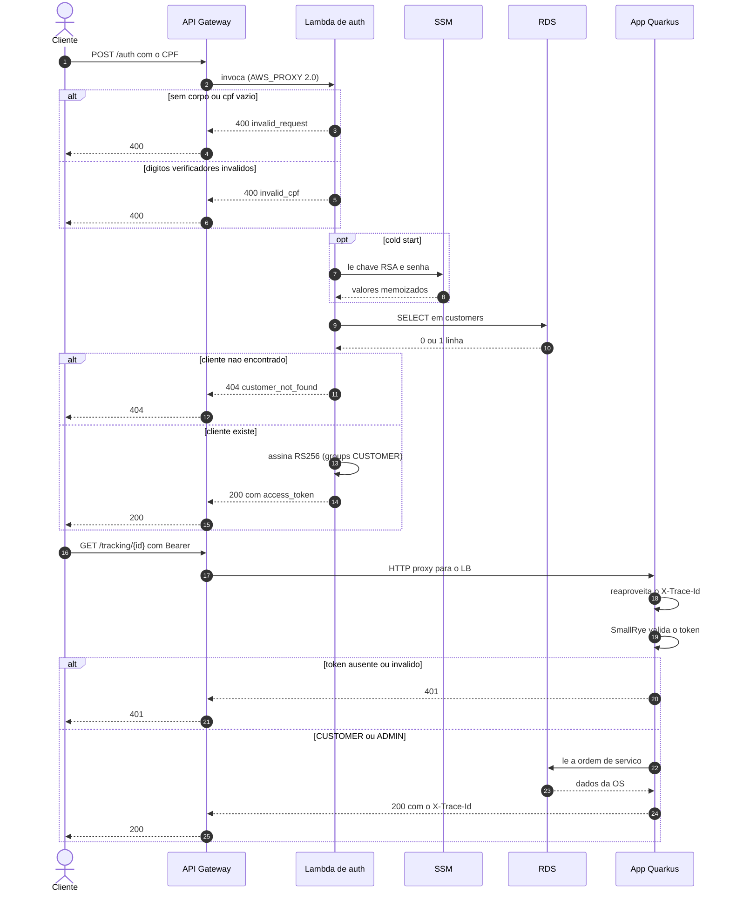
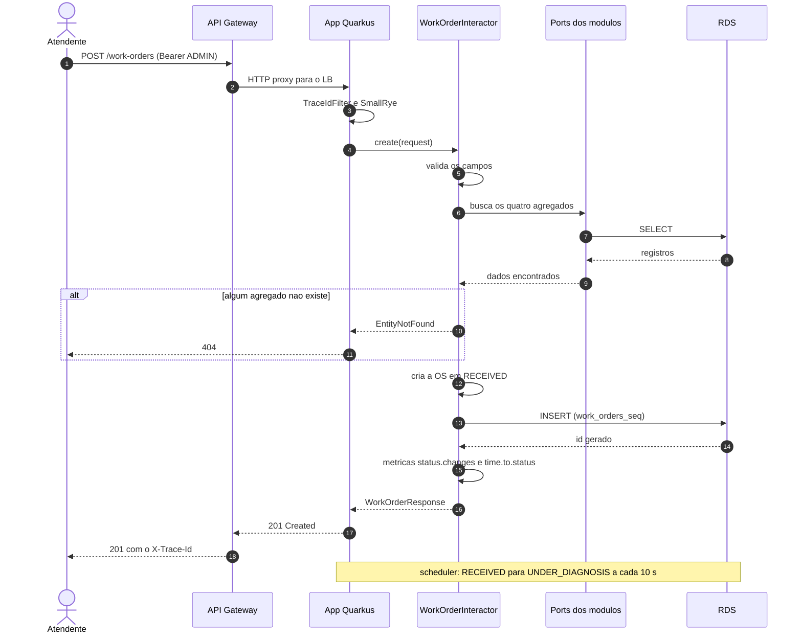

# Diagramas de sequência

Os dois fluxos que o Tech Challenge pede: o cliente obtendo um token só com o CPF, e o atendente
abrindo uma ordem de serviço. Os dois passam pela mesma borda (API Gateway → ELB → pod) e pela mesma
validação de JWT na aplicação.

## 1. Autenticação por CPF e uso do token

O que o diagrama não mostra e importa:

- **A aplicação não foi alterada para aceitar o token da Lambda.** O SmallRye valida com a chave
  pública, o `iss` `https://oficina-api.com` e a claim `groups` — o mesmo que já validava para o token
  de admin. A Lambda apenas assina com a chave privada do mesmo par
  (`fiap-fase3-auth-serverless/lambda/jwt.mjs`, `src/main/resources/application.properties`).
- **Sem `aud`.** A app não configura `mp.jwt.verify.audiences`; emitir audiência que ninguém verifica
  só simularia uma checagem.
- **Segredos nunca em variável de ambiente.** A Lambda recebe por env só os **nomes** dos parâmetros
  e lê os valores cifrados em runtime (`lambda/config.mjs`). O par RSA chega ao pod como volume de
  Secret, não como env var (`k8s/application/deployment.yaml`).
- **`X-Trace-Id` atravessa intacto.** O Gateway não carimba o header (`apigateway.tf`): `overwrite`
  apagaria o id do cliente e `append` produziria `id-cliente,id-gateway`.
- **A validação de CPF é um espelho.** `lambda/cpf.mjs` reproduz `CustomerDomainValidator.isValidCpf`,
  inclusive por não aceitar pontuação — divergir faria a app aceitar um documento que a Lambda recusa.

### Respostas do `POST /auth`

Verificadas pelo Gateway provisionado pelo pipeline em 2026-09-03:

| Entrada | Resposta | Por quê |
|---|---|---|
| Sem corpo, JSON inválido ou `cpf` vazio | `400 invalid_request` | o campo não foi preenchido — distinto de "documento errado" |
| CPF com dígitos verificadores inválidos | `400 invalid_cpf` | não é 404: responder "não encontrado" a um CPF impossível faria do endpoint um oráculo de quais CPFs existem |
| CPF válido, cliente inexistente | `404 customer_not_found` | não é 401: nada foi recusado por falta de credencial, o recurso é que não existe |
| CPF de cliente cadastrado | `200` com `access_token`, `token_type: Bearer`, `expires_in: 3600` | claims `sub`, `iss`, `groups`, `cpf`, `iat`, `exp`; sem `aud` |
| Rota protegida com o token | `200` | `GET /carworkshop/v1/tracking/{id}` pelo Gateway |
| Rota protegida sem token | `401` | recusado pelo SmallRye na app, não pelo Gateway |
| Falha interna (SSM, RDS) | `500 internal_error` | causa no CloudWatch da função; CPF sai **mascarado** no log. Único caso não exercitado na verificação: é o contrato de `lambda/index.mjs` |

Medido na função em 2026-09-02/03: cold start de 890 ms, invocação quente de 5,8 ms, 111 MB de
memória usados dos 256 configurados.

## 2. Abertura de uma ordem de serviço

Pontos do fluxo que vêm direto do código:

- **O caso de uso não conhece o framework.** `WorkOrderInteractor` só fala com portas
  (`CustomerDataPort`, `VehicleDataPort`, `AutoServiceDataPort`, `InventoryDataPort`,
  `WorkOrderRepositoryPort`, `WorkOrderMetricsPort`). A regra `usecase ∌ infrastructure` é imposta
  por ArchUnit e quebra o build se violada.
- **Snapshot no momento da criação.** `WorkOrder.create` guarda `customerEmail` e `vehiclePlate`, e o
  JPA persiste serviços e peças com descrição e preço **da época** em `work_order_services` e
  `work_order_parts`. O porquê está em [banco-de-dados.md](banco-de-dados.md).
- **Ids sem sobreposição entre réplicas.** As sequences são `INCREMENT BY 1` e as entidades usam
  `@SequenceGenerator(allocationSize = 1)`. Com o default de 50 do Hibernate, duas réplicas reservavam
  blocos sobrepostos e a escrita concorrente falhava com `duplicate key` — bug herdado da Fase 2,
  encontrado com carga real em 2026-09-03 e corrigido sem migration.
- **Toda transição alimenta as métricas.** `recordTransition` incrementa o contador por status e
  registra o tempo desde a criação até aquele status; `completeWorkOrder` registra ainda o tempo
  total. São as fontes dos painéis "Ordens de Serviço" do dashboard.
- **O log da criação chega ao New Relic com o `traceId`.** `Work Order N created` sai em JSON com o
  MDC, e o agente Java o envia com `context.traceId` — é o campo pelo qual a linha é encontrada a
  partir do `X-Trace-Id` que o cliente mandou.

### Transições seguintes

| Transição | Quem dispara | Endpoint | Papel |
|---|---|---|---|
| `RECEIVED → UNDER_DIAGNOSIS` | `DiagnosisSchedulerService` (`@Scheduled(every = "10s")`) | — | automático |
| `UNDER_DIAGNOSIS → PENDING_APPROVAL` | atendente registra diagnóstico, orçamento é calculado | `POST /work-orders/{id}/complete-diagnosis` | ADMIN |
| `PENDING_APPROVAL → IN_PROGRESS` | cliente aprova o orçamento | `POST /tracking/{id}/approve` | CUSTOMER ou ADMIN |
| `PENDING_APPROVAL → CANCELED` | cliente rejeita | `POST /tracking/{id}/reject` | CUSTOMER ou ADMIN |
| `IN_PROGRESS → COMPLETED` | serviço concluído; `end_date` preenchido | `PATCH /work-orders/{id}/complete` | ADMIN |
| `COMPLETED → DELIVERED` | veículo entregue | `PATCH /work-orders/{id}/deliver` | ADMIN |

Transição inválida lança `InvalidOperationException` no domínio e sai como HTTP 409. É por isso que o
alerta "Falha no processamento de OS" olha só 5xx: 4xx é o cliente pedindo o impossível, não a
aplicação falhando.
